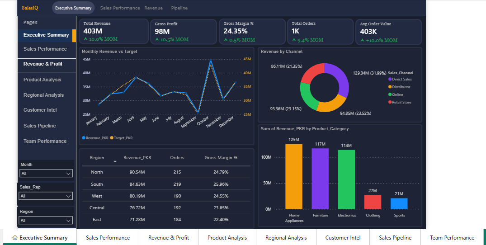
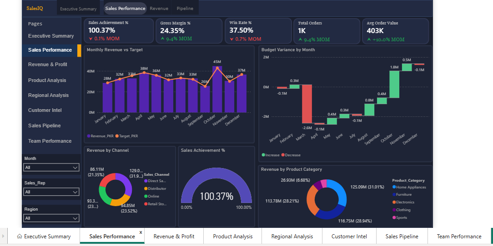
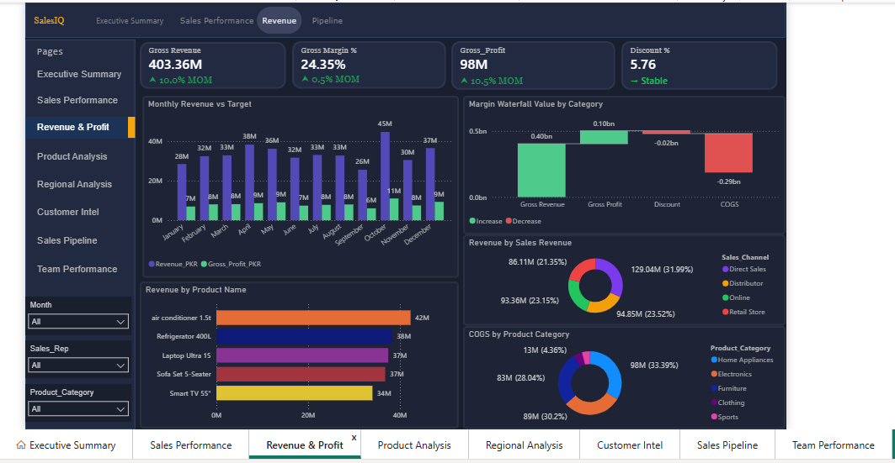
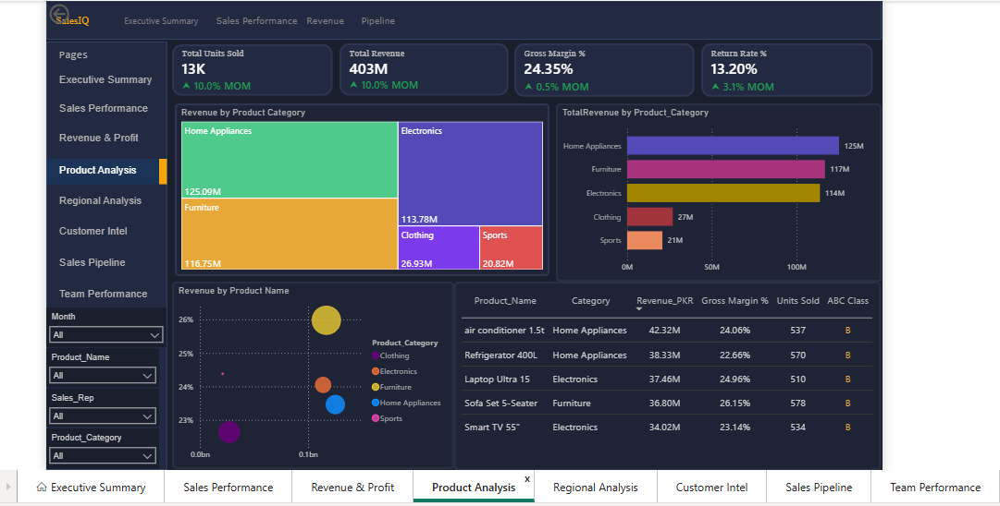
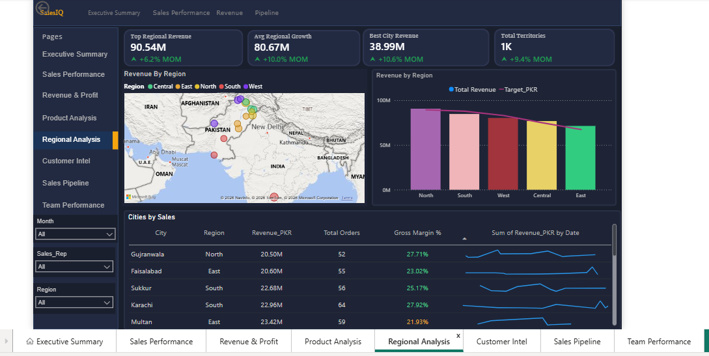
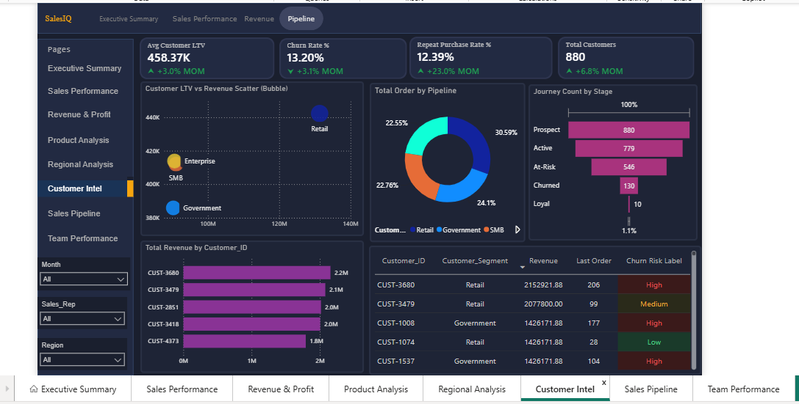
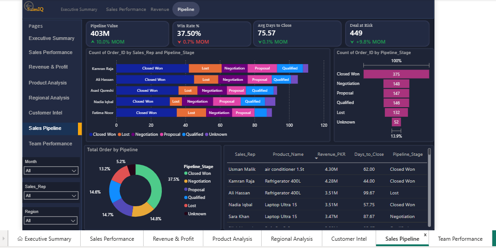
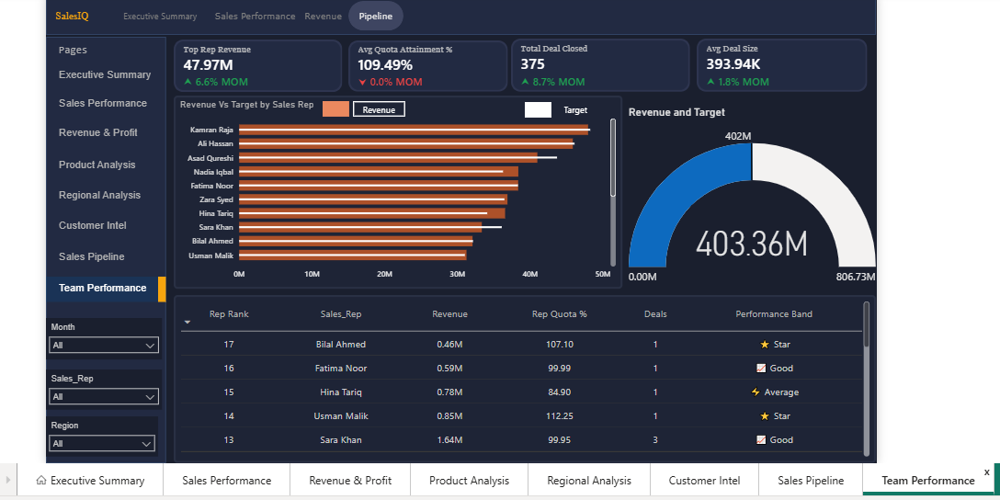

# 📈 Enterprise Sales Analytics Dashboard | Power BI

<p align="center">
  
  
  
  
  
</p>

---

# 📖 Overview

The **Enterprise Sales Analytics Dashboard** is an end-to-end Business Intelligence project developed using **Power BI, Excel, Python, and DAX**.

The dashboard provides a comprehensive analysis of enterprise sales by transforming raw transactional data into meaningful business insights. It enables organizations to monitor KPIs, evaluate sales performance, analyze customer behavior, identify profitable products, and support strategic decision-making through interactive dashboards.

---

# 🎯 Project Objectives

- Analyze enterprise sales performance.
- Monitor revenue, profit, and order trends.
- Identify top-performing products and customers.
- Compare sales across different regions.
- Analyze sales representatives' performance.
- Track monthly and yearly business growth.
- Provide actionable business insights.

---

# 📷 Dashboard Preview

## 🏠 Executive Dashboard

<p align="center">

</p>

---

## 📊 Sales Overview

<p align="center">

</p>

---

## 👥 Revenue and Profit Overview

<p align="center">

</p>

---

## 📦 Product Performance

<p align="center">

</p>

---

## 🌍 Regional Analysis

<p align="center">

</p>

---

## 💰 Customer Analysis

<p align="center">

</p>

---

## 📈 Sales Pipeline

<p align="center">

</p>

---

## 💡 Team Performance

<p align="center">

</p>

---

# 🐍 Python Data Analysis (EDA)

Before building the Power BI dashboard, the dataset was analyzed and validated using Python.

<p align="center">

</p>

Python was used for:

- Data Loading
- Missing Value Analysis
- Duplicate Detection
- Data Validation
- Exploratory Data Analysis (EDA)
- Data Cleaning

---

# 📊 Dashboard Features

### 📌 KPI Cards

- 💰 Total Revenue
- 📈 Total Profit
- 📦 Total Orders
- 👥 Total Customers
- 💵 Average Order Value

### 📊 Interactive Visualizations

- Sales Trend Analysis
- Revenue by Region
- Customer Analysis
- Product Analysis
- Sales Representative Performance
- Category Analysis
- Profit Analysis
- Interactive Slicers & Filters

---

# 🛠️ Tech Stack

| Technology | Purpose |
|------------|---------|
| Microsoft Power BI | Dashboard Development |
| Microsoft Excel | Dataset |
| Power Query | Data Transformation |
| DAX | KPI Calculations |
| Python | Data Cleaning & EDA |

---

# 📂 Dataset

The dashboard is built using an enterprise sales dataset containing:

- Customer Information
- Product Details
- Sales Representatives
- Orders
- Revenue
- Profit
- Quantity
- Regions
- Order Dates

---

# 📈 Key Insights

- Monitor overall sales performance through executive KPIs.
- Compare sales performance across multiple regions.
- Identify high-value customers.
- Discover top-selling and most profitable products.
- Analyze monthly sales growth.
- Evaluate sales representative performance.
- Support business decisions using interactive reports.

---

# 🚀 Skills Demonstrated

- Data Cleaning
- Exploratory Data Analysis (EDA)
- Data Transformation
- Power Query
- Data Modeling
- DAX Measures
- KPI Development
- Dashboard Design
- Business Intelligence
- Data Visualization
- Business Storytelling

---

# 📁 Repository Structure

```text
ENTERPRISE_SALE_DASHBOARD/
│
├── Dashboard/
│   └── Enterprise Sales Dashboard.pbix
│
├── Dataset/
│   └── Sales Dataset.xlsx
│
├── images/
│   ├── Capture1.PNG
│   ├── Capture2.PNG
│   ├── Capture3.PNG
│   ├── Capture4.PNG
│   ├── Capture5.PNG
│   ├── Capture6.PNG
│   ├── Capture7.PNG
│   ├── Capture8.PNG
│   └── eda_overview using python.png
│
├── Project Details/
│   └── Enterprise Sales Analytics Dashboard.pdf
│
├── Python/
│   └── clean.py
│
└── README.md
```

---

# 📄 Project Documentation

A detailed explanation of the dashboard, KPIs, business objectives, and report pages is available in:

```text
Project Details/
└── Enterprise Sales Analytics Dashboard.pdf
```

---

# ⚙️ Getting Started

## 1️⃣ Clone Repository

```bash
git clone https://github.com/MuneebMehmood260/ENTERPRISE_SALE_DASHBOARD.git
```

## 2️⃣ Open Power BI Desktop

Open:

```text
Dashboard/Enterprise Sales Dashboard.pbix
```

## 3️⃣ Refresh Dataset

Refresh the Excel data source if required.

## 4️⃣ Explore Dashboard

Use interactive filters and slicers to explore sales performance and business insights.

---

# 🎓 Learning Outcomes

This project strengthened my understanding of:

- Enterprise Sales Analysis
- Business Intelligence
- Dashboard Design
- Power Query
- DAX
- Data Modeling
- Python for EDA
- KPI Reporting
- Interactive Reporting
- Business Storytelling

---

# 🔮 Future Improvements

- AI-powered Insights
- Sales Forecasting
- Customer Segmentation
- Inventory Optimization
- Dynamic Tooltips
- Drill-through Reports
- Executive Summary Dashboard
- Advanced DAX KPIs

---

# 👨‍💻 About Me

**Muhammad Muneeb Mehmood**

Aspiring Data Analyst passionate about transforming raw data into actionable business insights using **Power BI, SQL, Python, Excel, and Data Visualization.**

### 🔗 Connect With Me

**GitHub**

https://github.com/MuneebMehmood260

**LinkedIn**

www.linkedin.com/in/muneeb-mehmood01


---

# ⭐ Support

If you found this project useful, please consider giving it a **Star ⭐** on GitHub.

Your support motivates me to continue building real-world Data Analytics and Business Intelligence projects.

---

# 📬 Feedback

Suggestions and feedback are always welcome.

Feel free to open an issue or connect with me on LinkedIn.